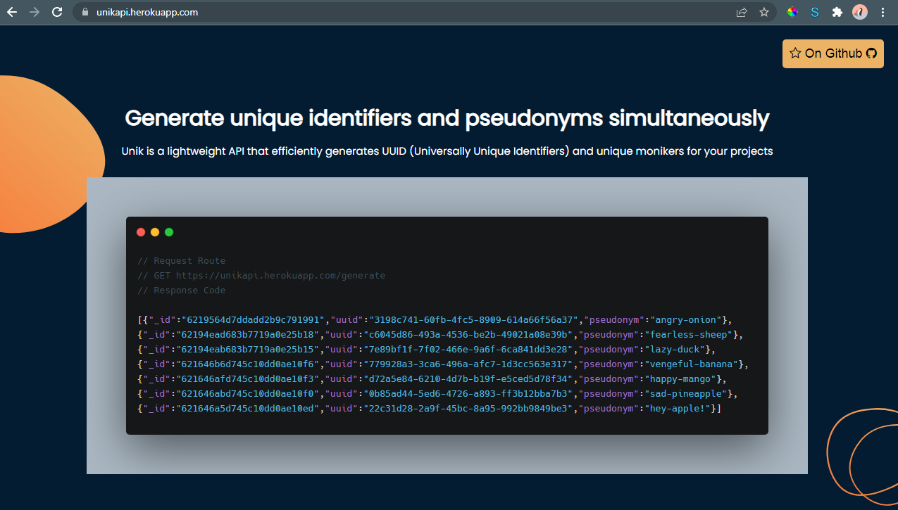

# Unik API 🚀⚡

### An API that generates UUIDs and pseudonyms simultaneously for developer consumption 😋
### You want to generate unique identifiers but you don't wanna go through the stress of installating packages? Unik API is literally "a call" away! 😎
### Ever wanted to generate random names or monikers for whatsoever reason? Unik API is excatly what the doctor ordered 🚀⚡
